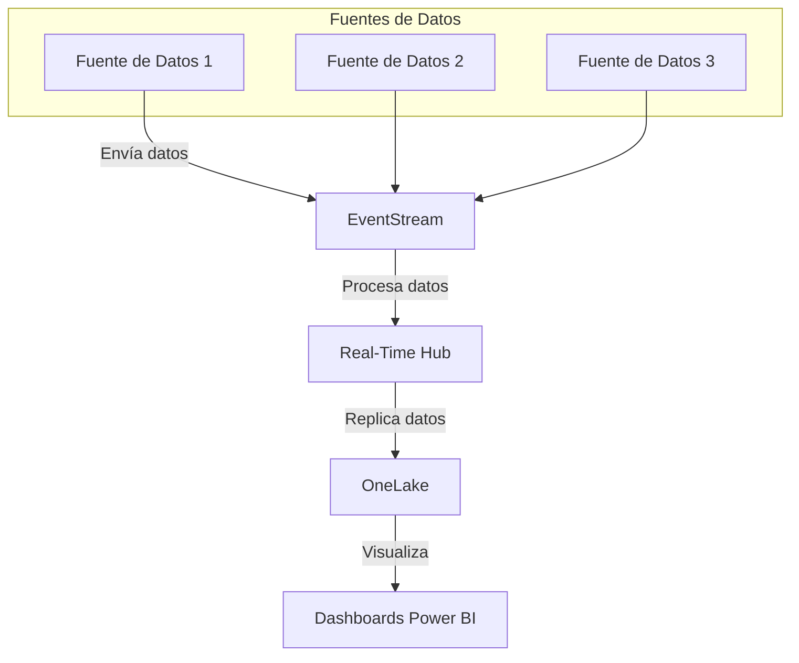

# **04-02Analítica en Tiempo Real en Microsoft Fabric**

## **1. Introducción a la Analítica en Tiempo Real**

### 🔹**Qué es la Analítica en Tiempo Real?**

La **analítica en tiempo real** se refiere a la capacidad de procesar, analizar y visualizar datos a medida que se generan o se reciben, sin la necesidad de esperar a que se completen procesos batch o se acumulen grandes volúmenes de datos. Esto permite a las organizaciones obtener insights instantáneos, reaccionar de inmediato ante eventos y tomar decisiones fundamentadas en información actualizada al instante.

- **Definición:**  
    Es el proceso de transformar datos en movimiento en información accionable en el mismo instante en que se producen los eventos.
- **Importancia:**  
    En un mundo cada vez más competitivo y dinámico, la velocidad en la toma de decisiones es clave. La analítica en tiempo real ayuda a:
    - Detectar y responder rápidamente a incidencias.
    - Optimizar procesos operativos.
    - Mejorar la experiencia del cliente mediante respuestas inmediatas.
- **Ejemplos comunes:**
    - Monitorización de transacciones financieras para detectar fraudes.
    - Seguimiento de flotas de vehículos en tiempo real en el sector logístico.
    - Gestión de inventario en retail y supervisión de procesos en manufactura.

### 🔹**Contexto y Necesidad en la Era Digital**

El auge de tecnologías como IoT, la creciente cantidad de dispositivos conectados y el aumento exponencial de datos generan la necesidad de poder analizar y actuar sobre estos datos en tiempo real.

- **Big Data e IoT:**  
    La proliferación de dispositivos IoT y sensores en entornos industriales, urbanos y de consumo genera grandes volúmenes de datos. Analizar estos datos en el instante en que se producen es esencial para obtener ventajas competitivas.
- **Toma de Decisiones Inmediata:**  
    En sectores como finanzas, salud, retail y manufactura, una decisión retrasada puede representar pérdidas económicas o impactos negativos en la seguridad y satisfacción del cliente.
- **Beneficios de la Inmediatez:**
    - **Mejora en la eficiencia operativa:** Identificación temprana de cuellos de botella y problemas en procesos críticos.
    - **Optimización de recursos:** Ajuste dinámico de operaciones y asignación de recursos en función de la demanda instantánea.
    - **Experiencias personalizadas:** Capacidad para interactuar con clientes en el momento preciso, brindando ofertas o soluciones personalizadas.

---

## **2. Arquitecturas para la Analítica en Tiempo Real**

### 🔹**Diferencia entre Arquitectura Tradicional y Arquitectura en Tiempo Real**

Las arquitecturas tradicionales de análisis de datos suelen basarse en procesos batch (por lotes), donde los datos se recopilan, se almacenan y se procesan en períodos determinados (diarios, semanales, etc.). Este enfoque es adecuado para análisis históricos y reportes periódicos, pero resulta insuficiente para escenarios donde la inmediatez es clave.

En contraste, la **arquitectura en tiempo real** está diseñada para manejar datos de forma continua y ofrecer respuestas inmediatas. Algunas diferencias principales son:

- **Retraso en la actualización:**
    - _Batch:_ Puede haber horas o días de retraso en la actualización de los datos.
    - _Tiempo Real:_ Los datos se actualizan en segundos o milisegundos.
- **Tipo de procesamiento:**
    - _Batch:_ Procesamiento por lotes, ideal para grandes volúmenes de datos históricos.
    - _Tiempo Real:_ Procesamiento de streams o flujos continuos de datos, permitiendo un análisis instantáneo.
- **Casos de uso:**
    - _Batch:_ Reportes periódicos, análisis histórico.
    - _Tiempo Real:_ Monitorización de sistemas, detección de fraudes, análisis de tendencias inmediatas.

### 🔹**Modelos Arquitectónicos para Procesamiento en Tiempo Real**

Dentro de las arquitecturas de análisis en tiempo real, existen varios modelos que permiten organizar y estructurar el procesamiento de datos en movimiento. Dos de los enfoques más comunes son:

#### **Arquitectura Lambda**

- **Concepto:**  
    La arquitectura Lambda combina dos caminos de procesamiento:
    - **Batch Layer:** Procesa grandes volúmenes de datos en intervalos regulares para generar vistas históricas.
    - **Speed Layer (o Real-Time Layer):** Procesa datos en tiempo real para ofrecer resultados inmediatos.
- **Ventajas:**
    - Permite tener tanto análisis históricos como en tiempo real.
    - Asegura la exactitud al combinar resultados batch con resultados instantáneos.
- **Desafíos:**
    - Mayor complejidad en la integración de ambos caminos.
    - Duplicación de lógica de procesamiento.

#### **Arquitectura Kappa**

- **Concepto:**  
    La arquitectura Kappa propone un único camino para el procesamiento de datos: todo se procesa como un flujo de datos en tiempo real.
- **Ventajas:**
    - Simplifica la arquitectura al eliminar la necesidad de mantener dos sistemas paralelos.
    - Permite re-procesar datos históricos utilizando el mismo mecanismo que los datos en vivo.
- **Desafíos:**
    - Puede requerir sistemas de almacenamiento y procesamiento muy eficientes para manejar tanto datos históricos como en tiempo real.

### 🔹**Componentes Clave en una Arquitectura de Análisis en Tiempo Real**

Para diseñar una arquitectura de análisis en tiempo real, se deben considerar los siguientes componentes:

- **Ingesta de Datos:**  
    Herramientas y mecanismos que permiten capturar datos en movimiento desde diversas fuentes (sensores, logs, aplicaciones, etc.). Ejemplos: Apache Kafka, Event Hubs.
    
- **Procesamiento en Streaming:**  
    Motores que procesan los datos conforme llegan, permitiendo realizar transformaciones, filtrados y agregaciones en tiempo real. Ejemplos: Apache Spark Streaming, Flink.
    
- **Almacenamiento en Tiempo Real:**  
    Bases de datos o almacenes de datos diseñados para almacenar grandes volúmenes de datos de manera eficiente y con baja latencia. Ejemplos: bases de datos NoSQL, almacenes de datos en memoria.
    
- **Visualización y Dashboards:**  
    Herramientas de BI que permiten crear dashboards en tiempo real para monitorizar los datos. Ejemplos: Power BI, Tableau.
    
- **Consultas y Análisis:**  
    Lenguajes y herramientas de consulta (como KQL – Kusto Query Language) que permiten analizar rápidamente la información.
    
- **Integración y Orquestación:**  
    Sistemas que permiten coordinar y conectar todos los componentes anteriores, asegurando un flujo continuo de datos desde la fuente hasta la visualización.
    

---

## **3. La Arquitectura de Analítica en Tiempo Real en Microsoft Fabric**

Microsoft Fabric ha sido diseñado para unificar diversas cargas de trabajo de análisis de datos en una única plataforma SaaS. En el contexto de la analítica en tiempo real, Fabric ofrece una serie de componentes y funcionalidades que simplifican la ingesta, el procesamiento y la visualización de datos en movimiento.

### 🔹**Microsoft Fabric: Una Plataforma Unificada**

Microsoft Fabric integra múltiples experiencias de análisis de datos, como Data Engineering, Data Warehouse, Data Science, y Real-Time Intelligence, dentro de una única solución basada en la nube. Algunas de sus ventajas son:

- **Integración Nativa:**  
    No es necesario combinar soluciones de diferentes proveedores, ya que Fabric integra de manera nativa los procesos de ingesta, transformación y visualización.
- **Unificación de Datos:**  
    Todos los datos, ya sean estructurados, semiestructurados o en texto, se almacenan en un único repositorio centralizado llamado **OneLake**, lo que elimina los silos y facilita la colaboración.
- **Simplicidad y Escalabilidad:**  
    Fabric simplifica la complejidad inherente a la gestión de infraestructura, permitiendo que los usuarios se concentren en el análisis y la toma de decisiones.
---
### 🔹**Componentes de Analítica en Tiempo Real en Fabric**

Dentro de Microsoft Fabric, la analítica en tiempo real se compone de varios elementos que trabajan conjuntamente para transformar datos en movimiento en insights accionables. A continuación, se describen los componentes clave:

#### **EventStream**

- **Descripción:**  
    Es el componente encargado de gestionar la ingesta de datos en streaming. Permite capturar eventos de diversas fuentes y llevarlos al sistema de análisis.
- **Características:**
    - **Ingesta Automática:** La ingesta de datos en streaming está habilitada por defecto, lo que facilita la integración con orígenes de eventos tanto internos como externos.
    - **Indexación por Defecto:** Todos los datos ingeridos se indexan automáticamente, permitiendo consultas rápidas y eficientes.
    - **Particionado de Datos:** Los datos se particionan por tiempo y hash, lo que optimiza el rendimiento de las consultas.
- **Beneficios:**
    - **Reducción de la Complejidad:** El manejo automático de la ingesta y el particionado simplifica la arquitectura.
    - **Escalabilidad:** Capacidad para manejar grandes volúmenes de datos sin degradar el rendimiento.
- **Emoticono:** ¡Captura cada evento en el momento preciso! 📡

#### **EventHouse**

- **Descripción:**  
    Aunque el término “eventhouse” puede no ser tan conocido fuera del ecosistema Fabric, en este contexto se refiere al almacenamiento y la gestión lógica de los eventos procesados.
- **Características:**
    - **Almacenamiento Lógico:** Permite organizar y estructurar los eventos para facilitar su análisis.
    - **Integración con otros Componentes:** Funciona de manera complementaria con EventStream, ofreciendo una copia lógica de los datos para análisis adicionales.
- **Beneficios:**
    - **Optimización del Procesamiento:** Facilita la transformación y el filtrado de los datos en tiempo real.

#### **Real-Time Hub**

- **Descripción:**  
    Es la interfaz centralizada en Microsoft Fabric para gestionar y consumir datos en tiempo real.
- **Características:**
    - **Integración Completa:** Está integrado con todos los componentes de ingesta y procesamiento, lo que permite a los usuarios descubrir, gestionar y consumir datos en movimiento.
    - **Mirroring a OneLake:** Los datos procesados en tiempo real pueden replicarse automáticamente en OneLake, facilitando su reutilización en otros escenarios de análisis.
    - **Transformaciones In-Place:** Permite realizar transformaciones directamente sobre los datos sin necesidad de moverlos a otro repositorio.
- **Beneficios:**
    - **Acceso Rápido:** Facilita la consulta inmediata de los datos para generar insights al instante.
    - **Interoperabilidad:** Los datos del Real-Time Hub pueden ser consumidos por otros componentes de Fabric, como dashboards y herramientas de visualización.

#### **Dashboards en Tiempo Real y Power BI**

- **Descripción:**  
    Microsoft Fabric se integra de forma nativa con Power BI para ofrecer dashboards en tiempo real.
- **Características:**
    - **Visualización Dinámica:** Permite crear reportes y dashboards que se actualizan de forma continua, mostrando información en tiempo real.
    - **Interactividad:** Los usuarios pueden interactuar con los datos, aplicar filtros y profundizar en los detalles sin necesidad de recargar la página.
    - **Integración con Orígenes de Eventos:** Gracias a la integración nativa con EventStream y el Real-Time Hub, los dashboards reflejan los datos más recientes.
- **Beneficios:**
    - **Decisiones Instantáneas:** Los líderes empresariales pueden tomar decisiones basadas en datos actualizados al minuto.
    - **Mayor Transparencia:** Facilita el seguimiento de KPIs y métricas críticas en tiempo real.

#### **KQL (Kusto Query Language)**

- **Descripción:**  
    KQL es un lenguaje de consulta optimizado para el análisis de grandes volúmenes de datos en tiempo real.
- **Características:**
    - **Consultas Rápidas y Eficientes:** Permite realizar búsquedas y análisis complejos con baja latencia.
    - **Flexibilidad:** Soporta consultas sobre datos estructurados, semiestructurados y en texto.
    - **Integración Nativa:** Se integra de forma natural con los datos almacenados en el Real-Time Hub y OneLake.
- **Beneficios:**
    - **Profundidad Analítica:** Los usuarios pueden extraer insights complejos y detallados de los datos en tiempo real.
    - **Interactividad:** Facilita la creación de análisis ad hoc que pueden ajustar las respuestas según las necesidades inmediatas.
---
### 🔹**Integración y Flujo de Datos en Fabric**

En Microsoft Fabric, el flujo de datos para la analítica en tiempo real se puede resumir en los siguientes pasos:

1. **Captura de Datos en Tiempo Real:**
    
    - Los datos se capturan mediante **EventStream** a partir de diversas fuentes (por ejemplo, dispositivos IoT, logs de aplicaciones, cambios en bases de datos, etc.).
    - La ingesta se realiza de forma automática y está optimizada para manejar grandes volúmenes sin intervención manual.
    - **Emoticono:** ¡Cada dato cuenta desde el primer instante! ⏱️
2. **Procesamiento y Transformación:**
    
    - Una vez capturados, los datos se procesan en streaming. Esto incluye transformaciones in-place, filtrados, agregaciones y particionamiento (por tiempo y hash).
    - Este procesamiento se lleva a cabo en el **Real-Time Hub**, lo que permite que los datos estén listos para ser consultados casi de inmediato.

3. **Almacenamiento y Mirroring:**
    
    - Los datos procesados se almacenan lógicamente en el **EventHouse** y, de forma opcional, se replican (mirroring) en **OneLake** para integrarlos con otras cargas de trabajo.
    - Este mecanismo de replicación asegura que los datos en tiempo real puedan ser consultados y analizados desde múltiples perspectivas, sin duplicación innecesaria.

4. **Consulta y Visualización:**
    
    - Mediante KQL y otras herramientas de consulta, los usuarios pueden analizar los datos en tiempo real directamente desde el **Real-Time Hub**.
    - Los resultados se pueden visualizar en dashboards interactivos a través de Power BI, permitiendo un seguimiento continuo de KPIs y métricas críticas.

    

---

## **4. Conclusiones y Perspectivas Futuras**

### 🔹**Resumen de lo Aprendido**

En este material hemos explorado en profundidad la analítica en tiempo real y su aplicación dentro del ecosistema de Microsoft Fabric. Los puntos clave incluyen:

- **Definición e importancia:**  
    La analítica en tiempo real permite convertir datos en movimiento en insights inmediatos, fundamentales para la toma de decisiones en entornos dinámicos.
- **Modelos arquitectónicos:**  
    Se han comparado arquitecturas tradicionales basadas en procesamiento batch con arquitecturas en tiempo real (Lambda y Kappa), destacando las ventajas y desafíos de cada una.
- **Componentes en Microsoft Fabric:**
    - **EventStream:** Para la ingesta automática y la indexación de datos en streaming.
    - **EventHouse:** Para la organización lógica de los eventos.
    - **Real-Time Hub:** Como interfaz central para gestionar y consumir datos en tiempo real, con mirroring a OneLake.
    - **Dashboards en Tiempo Real y Power BI:** Que permiten visualizar y analizar datos al instante.
    - **KQL:** Para realizar consultas rápidas y complejas en los datos.
- **Casos de uso:**  
    Se han presentado ejemplos concretos en industrias tan diversas como retail, finanzas, manufactura, telecomunicaciones y salud, ilustrando cómo la analítica en tiempo real aporta ventajas competitivas.
### 🔹**Reflexiones Finales**

✅ **Fabric permite análisis en tiempo real con EventStream, EventHouse y Real-Time Dashboards.**  
✅ **La integración con Power BI y Power Automate facilita la toma de decisiones en tiempo real.**  
✅ **El uso de KQL y SQL Analytics permite consultas rápidas sobre eventos en movimiento.**

Laboratorio de Ejemplo: [Announcing RTI End-to-End Sample | Microsoft Fabric Blog | Microsoft Fabric](https://blog.fabric.microsoft.com/en-us/blog/announcing-rti-end-to-end-sample?ft=All)
